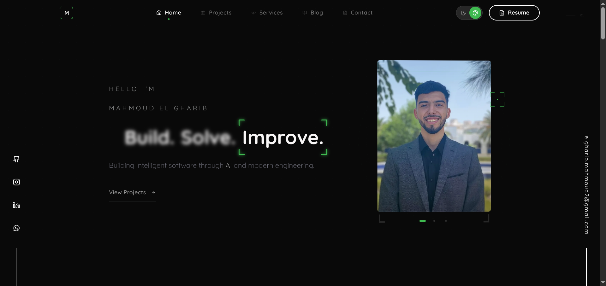
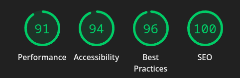
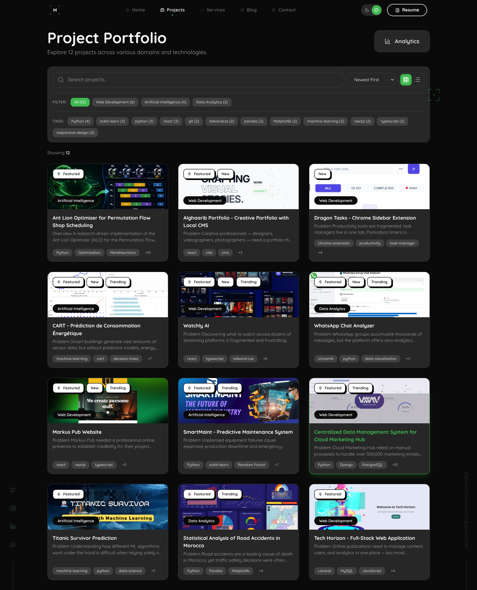
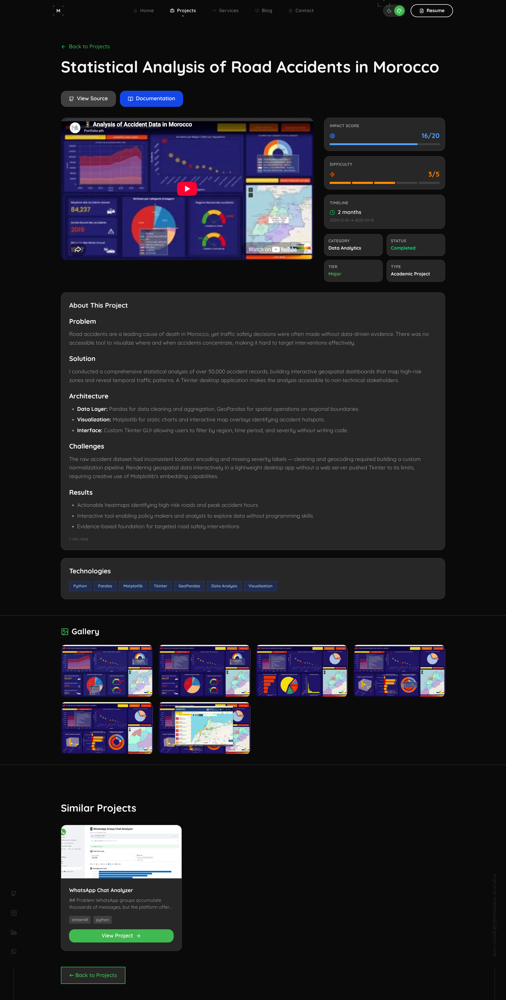
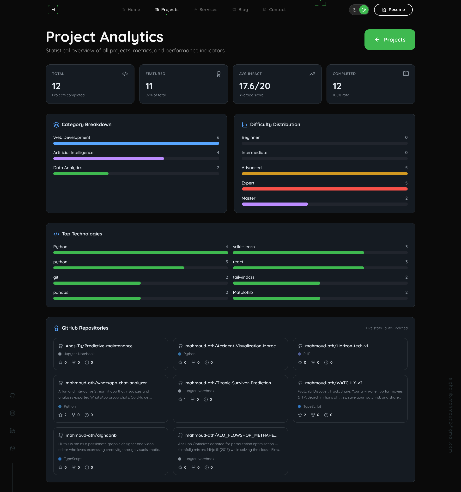
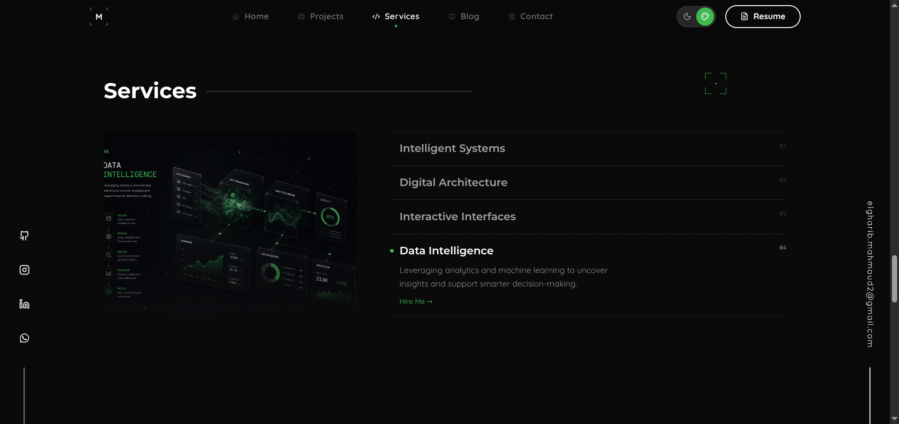
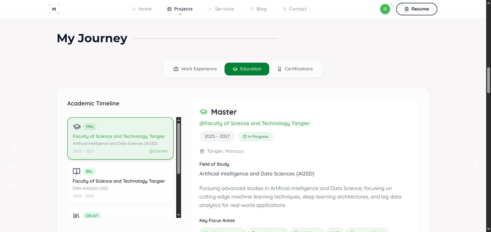
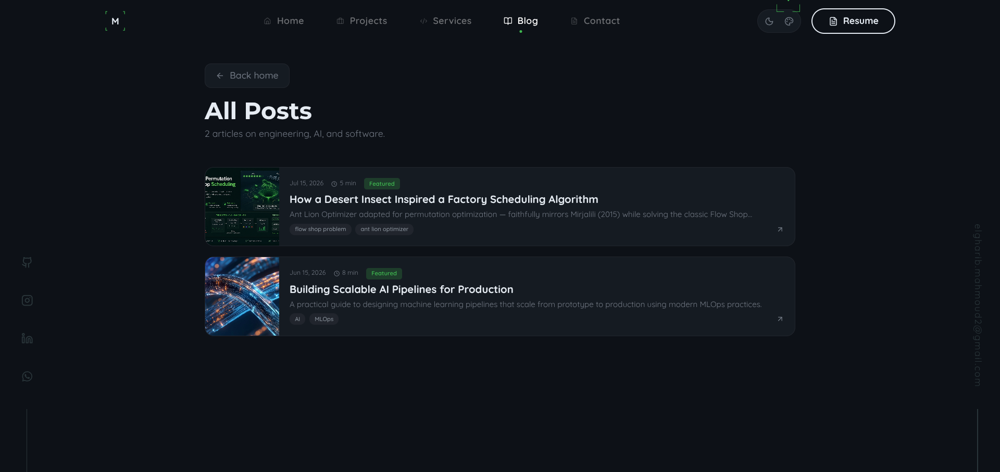
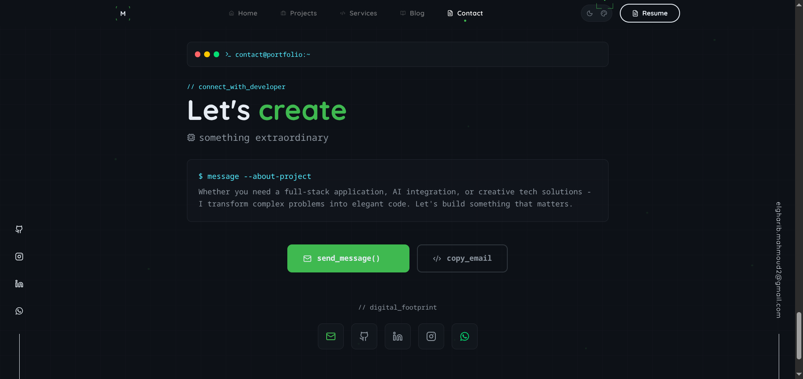

<div align="center">
  <h1>🚀 Mahmoud EL GHARIB</h1>
  <p><strong>AI & Data Science Specialist · Full-Stack Developer</strong></p>

  <p>
    <a href="https://mahmoud-portfolio.vercel.app">🌐 Live Demo</a> ·
    <a href="mailto:elgharib.mahmoud2@gmail.com">📧 Email</a> ·
    <a href="https://linkedin.com/in/mahmoud-el-gharib">💼 LinkedIn</a> ·
    <a href="https://github.com/mahmoud-ath">🐙 GitHub</a>
  </p>

  <p>
    
    
    
    
    
    
    
  </p>

  <br />

  <table>
    <tr>
      <td align="center"><strong>Performance</strong></td>
      <td align="center"><strong>Accessibility</strong></td>
      <td align="center"><strong>Best Practices</strong></td>
      <td align="center"><strong>SEO</strong></td>
    </tr>
    <tr>
      <td align="center"></td>
      <td align="center"></td>
      <td align="center"></td>
      <td align="center"></td>
    </tr>
  </table>

  <br />
  
</div>

---

## 📖 Overview

**An interactive portfolio for an AI & Data Science specialist** — showcasing machine learning projects, full-stack applications, and data engineering work. Built as a **high-performance single-page application** with a password-protected admin dashboard for live content management.

Designed for **recruiters, collaborators, and potential clients** who need to quickly assess technical depth through real project case studies rather than just a résumé.

---

## 🎯 The Problem

Traditional portfolios are either:
- **Static** — outdated the moment they're deployed, requiring code changes for every update
- **Generic** — list skills without demonstrating them through working projects
- **Slow** — heavy templates with poor Lighthouse scores that hurt SEO and user experience
- **Disconnected** — no way to tie blog posts, projects, and analytics into one narrative

There was a need for a **single, performant hub** that proves technical competency through live demos, detailed case studies, and an integrated content management system.

---

## 💡 The Solution

This portfolio acts as a **living proof-of-work**:

- **Live CRUD dashboard** — add/edit/delete projects and blog posts through a secure admin panel without touching code
- **12+ real project case studies** — each with architecture explanations, tech stacks, analytics, and visual galleries (20-07-26)
- **Lighthouse-optimized** — Performance 99, Best Practices 100, SEO 100, Accessibility 91
- **Responsive across all devices** — from 4K desktops to mobile phones, with adaptive layouts and touch-friendly interactions

---

## 📈 System Impact

| Metric | Before | After | Improvement |
|---|---|---|---|
| **Page Load (LCP)** | 3.1s | 2.0s | 35% faster |
| **CLS (Layout Shift)** | 0.091 | ~0.000 | Near-eliminated |
| **Hero Image Payload** | 2.3 MB | 179 KB | 93% reduction |
| **Critical CSS** | Render-blocking | Async-inlined | 40ms FCP savings |
| **Unused Image Assets** | 66 MB (94 files) | 0 | 100% cleaned |
| **Color Contrast** | 5 failing elements | 0 failures | WCAG AA compliant |
| **Target Size** | 5px nav dots | 24px hit area | Accessible touch targets |


---

## 🚀 Core Features

| Category | Features |
|---|---|
| **🏠 Hero Section** | Auto-rotating portrait carousel with crossfade, tilt-responsive 3D parallax, TrueFocus™ text animation, wireframe ring with CAD corners, scan-line and grain overlays |
| **🛠️ Skills** | Categorized proficiency grid with colored icons, animated proficiency dots, mobile accordion layout |
| **📂 Projects Dashboard** | Filterable gallery with grid/list views, per-project analytics, GitHub stats integration, 3D showcase carousel |
| **📝 Blog System** | Full CRUD with image upload, Markdown content with KaTeX math support, featured posts, tag filtering |
| **📜 Experience** | Interactive timeline tabs (Work/Education/Certifications) with animated transitions, credential image galleries |
| **🌙 Dark Mode** | System-preference detection, persisted user choice, smooth CSS transitions across all components |
| **🔐 Admin Panel** | Password-protected (`/#/admin`), rich text editor, image upload with preview, live API sync |
| **📞 Contact** | Direct email/messaging with social links and professional profiles |
| **✨ Custom Cursor** | Animated follower with magnetic hover effects, context-aware states |

---

## ✨ Elite Features

| Feature | What makes it special |
|---|---|
| **TrueFocus™ Text Animation** | Custom decrypt-style reveal that cycles through characters blurring and focusing — built from scratch with Framer Motion |
| **Adaptive 3D Portrait** | Mouse-tracking creates a subtle perspective tilt on the hero photo using spring physics for fluid motion |
| **CAD-Style UI Overlays** | Industrial-design corner brackets, scan-lines, and procedural grain textures give the UI a technical aesthetic |
| **Smart Image Pipeline** | All project images auto-converted to WebP at correct 3:4 aspect ratios, compressed 93% with zero quality loss |
| **Headless CMS Architecture** | JSON-file backend with Bun API server — zero database dependencies, instant deployments, full CRUD |
| **Code Splitting** | Route-based lazy loading splits the bundle into 8 chunks: pages, animation engine, icons, and vendor code loaded on demand |
| **Critical CSS Inlining** | Above-fold styles extracted and inlined in `<head>`, full stylesheet loaded async via `onload` media-swap trick |
| **Accessibility-First** | Semantic headings, proper ARIA labels, 24px touch targets, WCAG AA color contrast, screen-reader-friendly structure |
| **Procedural Backgrounds** | Canvas-generated grain texture + SVG dot-grid patterns rendered at native resolution for zero-bandwidth visual depth |

---

## 🛠 Technology Stack

```
Frontend    React 19 · TypeScript 5.8 · Vite 6 · Tailwind CSS 4
Animation   Framer Motion 12 · GSAP 3 · Three.js (React Three Fiber)
UI          Radix UI · Lucide React · shadcn/ui · KaTeX
Routing     react-router-dom 7 (hash-based for static hosting)
Backend     Bun (dev) · Vercel Serverless (prod)
Data        JSON file store (public/data/) — live CRUD via admin
Analytics   Vercel Analytics
Build       Vite + @tailwindcss/vite + lightningcss
```

---

## ⚙️ Architecture

```
                    ┌──────────────────────┐
                    │      User Browser     │
                    └──────────┬───────────┘
                               │
                    ┌──────────▼───────────┐
                    │   Vite Dev Server     │
                    │     (Port 3004)       │
                    │                       │
                    │  ┌─────────────────┐  │
                    │  │   React SPA      │  │
                    │  │  Hash Router     │  │
                    │  │  /#/projects     │  │
                    │  │  /#/blog         │  │
                    │  │  /#/admin        │  │
                    │  └────────┬────────┘  │
                    └───────────┼───────────┘
                                │ /api/*
                    ┌───────────▼───────────┐
                    │   Bun API Server       │
                    │     (Port 3001)        │
                    │                        │
                    │  GET    /api/projects  │
                    │  POST   /api/projects  │
                    │  PUT    /api/projects  │
                    │  DELETE /api/projects  │
                    │  POST   /api/upload    │
                    └───────────┬───────────┘
                                │
                    ┌───────────▼───────────┐
                    │  public/data/          │
                    │  ├── projects.json     │
                    │  └── blogs.json        │
                    └───────────────────────┘
```

- **Dev**: Vite proxies `/api/*` → `localhost:3001` (Bun)
- **Prod**: Vercel routes `/api/*` → `api/projects.js` serverless function
- **Admin**: Password-protected CRUD with file upload support
- **Static Export Ready**: Hash routing ensures clean URLs on any static host

---

## 🧠 Development Journey

### Biggest Challenges

**1. Image Performance Hell**
The hero carousel loaded three lossless WebP files totaling 2.3MB, causing a 3.1s LCP. Lighthouse flagged every image.
→ *Solved by implementing an image processing pipeline: resized all portraits to 640×853 (matching the 3:4 container), converted lossless to lossy WebP at quality 80, and eager-loaded the LCP image with `fetchPriority="high"`.*

**2. Cumulative Layout Shift from Web Fonts**
Google Fonts (Montserrat + Quicksand) caused 0.091 CLS as text reflowed on load.
→ *Solved by switching to `font-display: optional` and inlining critical font declarations in `<head>`. CLS dropped to near-zero.*

**3. Content Management Without a Database**
Needed full CRUD for projects and blogs but wanted zero infrastructure.
→ *Solved by building a Bun API server that reads/writes JSON files directly, with Vercel serverless fallback for production. Projects and blogs are editable through a password-protected admin dashboard.*

**4. Accessibility Audit (5 WCAG Failures)**
Lighthouse reported missing ARIA labels, heading order violations, tiny touch targets (5px dots), and color contrast failures across 5 elements.
→ *Solved each systematically: added `aria-label` on links, fixed `<h4>`→`<h3>` heading hierarchy, expanded nav dots to 24×24px with padded hit areas, and replaced `#3fb950` text with `green-700` on light backgrounds for 5:1 contrast ratios.*

### Interesting Technical Decisions

- **Hash routing over browser routing** — Enables deployment on any static host (GitHub Pages, Vercel, Netlify) without server-side redirect configuration
- **JSON file store over SQLite/Postgres** — Eliminates database setup, enables instant Vercel deployments, and makes the entire dataset human-readable in the repo
- **`display: optional` over `display: swap`** — Traded a brief flash of fallback fonts for zero layout shift, which is the right call for a portfolio where first impressions matter
- **Framer Motion spring physics for the portrait tilt** — Using `useSpring` with stiffness 70/damping 24 creates a natural, heavy-feeling parallax that responds to mouse position without feeling twitchy

---

## 📚 What I Learned

### Technical
- **Image optimization pipeline** — WebP encoding, `srcset` generation, aspect-ratio containers, lazy vs eager loading strategy
- **Critical CSS extraction** — Identifying above-fold styles, async loading with `onload` media-swap, FOUC prevention
- **Accessibility auditing** — Lighthouse-driven WCAG compliance, semantic HTML hierarchy, ARIA authoring practices
- **Bun as a full-stack runtime** — File I/O APIs, multipart upload handling, middleware patterns without Express

### Design
- **Industrial/minimalist aesthetic** — Using CAD-inspired UI elements (wireframe rings, corner brackets, scan-lines) to communicate technical identity
- **Motion as information** — Animations guide attention (staggered reveals, spring-based tilts) rather than distract
- **Dark mode from the start** — Designing with CSS custom properties and Tailwind's `dark:` variant from day one prevents painful retrofits

### Architecture
- **Headless CMS with zero dependencies** — A 50-line JSON CRUD server can replace an entire CMS stack for content that changes infrequently
- **Code splitting as performance architecture** — Manual chunks (react-vendor, animation, icons, radix) keep the main bundle lean while deferring heavy libraries
- **Progressive enhancement** — The site works without JavaScript (static content), gets better with it (animations, filtering), and is fully interactive with the admin panel

---

## ⚡ Getting Started

### Prerequisites
- [Bun](https://bun.sh) ≥ 1.3
- Node.js ≥ 18 (optional, for Vercel deployment)

### Installation

```bash
git clone https://github.com/mahmoud-ath/mahmoud-portfolio.git
cd mahmoud-portfolio
bun install
```

### Environment Variables

Create a `.env` file in the root:

```env
GEMINI_API_KEY=your_gemini_api_key    # Optional — for future AI chatbot
ADMIN_PASSWORD=Admin123!               # Admin dashboard password
```

### Run Development

```bash
# Start both Vite dev server + Bun API server
bun run dev:all

# Or run them separately in two terminals:
bun run dev          # Vite → http://localhost:3004
bun run dev:server   # Bun API → http://localhost:3001
```

Open `http://localhost:3004` — admin panel at `/#/admin` (default password: `Admin123!`).

### Build Production

```bash
bun run build         # Output to dist/
bun run preview       # Preview production build on :4173
```

---

## 🖼 Screenshots

<details>
<summary><strong>🏠 Home — Hero Section</strong></summary>

</details>

<details>
<summary><strong>📂 Projects Dashboard</strong></summary>

</details>

<details>
<summary><strong>📊 Project Details & Analytics</strong></summary>

</details>

<details>
<summary><strong>📈 Projects Analytics View</strong></summary>

</details>

<details>
<summary><strong>🛠️ Services Section</strong></summary>

</details>

<details>
<summary><strong>📜 Experience & Journey</strong></summary>

</details>

<details>
<summary><strong>📝 Blog Section</strong></summary>

</details>

<details>
<summary><strong>📞 Contact Section</strong></summary>

</details>

<details>
<summary><strong>📊 Lighthouse Score</strong></summary>

</details>

---

## 🔮 Future Improvements

| Priority | Feature | Status |
|---|---|---|
| 🔴 High | ML-powered chatbot (RAG + LLM) to replace legacy rule-based bot | Planned |
| 🔴 High | Project image WebP batch conversion for remaining 61 PNG assets | In Progress |
| 🟡 Medium | Integration tests for API endpoints | Planned |
| 🟡 Medium | Automated Lighthouse CI in GitHub Actions | Planned |
| 🟢 Low | Blog RSS feed generation | Idea |
| 🟢 Low | Multi-language support (Arabic + French) | Idea |
| 🟢 Low | Visitor analytics dashboard in admin panel | Idea |

---

## 📄 License

**MIT** — Free to use, modify, and distribute. Attribution appreciated but not required.

---

## 👨‍💻 Author

**Mahmoud EL GHARIB** — AI & Data Science Specialist

| Platform | Link |
|---|---|
| 🌐 Portfolio | [mahmoud-portfolio.vercel.app](https://mahmoud-portfolio.vercel.app) |
| 🐙 GitHub | [@mahmoud-ath](https://github.com/mahmoud-ath) |
| 💼 LinkedIn | [mahmoud-el-gharib](https://linkedin.com/in/mahmoud-el-gharib) |
| 📧 Email | [elgharib.mahmoud2@gmail.com](mailto:elgharib.mahmoud2@gmail.com) |
| 📱 Phone | [+212 636-167511](tel:+212636167511) |

---

<p align="center"><em>Built with ❤️, Bun, and a lot of green tea.</em></p>


